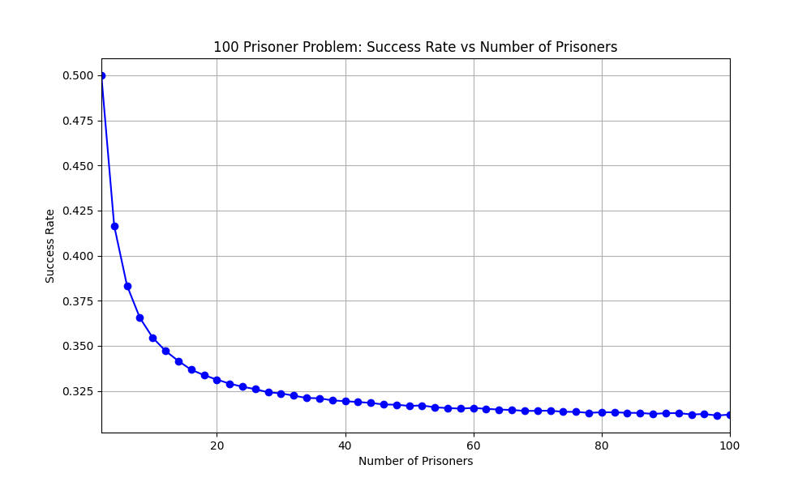

# 100 Prisoners Problem Simulator

Simple python script to simulate the famous [100 Prisoners Problem](https://en.wikipedia.org/wiki/100_prisoners_problem) based on the standard cycle method. 

## Project Overview

The simulator offers three main functionalities:

1. **Test Command (`test`):**  
   Runs an infinite loop that performs a single experiment for increasing numbers of prisoners (starting from 10 and multiplying by 10 each iteration). It prints the execution time of each experiment. Use `Ctrl+C` to stop the loop. Use this function to estimate the runtime before the experiments.  
   **Usage Examples:**
    ```
    python main.py test
    ```

2. **Run Command (`run`):**  
   Runs multiple experiments with a specified even number (>=2) of prisoners and logs each experiment’s process (the generated random permutation and the result) to `log.txt`.  
   **Usage Examples:**
   ```
   python main.py run 100 200
   ```
   In this examples, the program will run the experiment with `100` prisoners and calculate the average success rate over`200` experiments. It will print the average success rate in the console and log the experiment process in log.txt. 

3. **Plot Command (`plot`):**  
   Runs experiments for prisoner counts over a specified range (using only even numbers) and plots the success rate versus the number of prisoners. The plot is saved as `plot.png`. For each prisoner count, only the number of prisoners and success rate is logged to `log.txt`.  
   **Usage Example:**  
   ```
   python main.py plot 2 10 1000
   ```
   In this example, the program will run 1000 experiments for each even prisoner count from 2 to 10, i.e. 2, 4, 6, 8, 10.

## Estimate the Runtime for the Plot Command

1. Calculate the number of experiments needed based on the accuracy requirement. 
```
$ python main.py run 100 100000
After 100000 experiments with 100 prisoners:
Average success rate: 0.3130
Execution time: 2.378521 seconds. 
```
The experiments demonstrated a success rate of approximately 31.30% for 100 prisoners. 

The margin error is: 

$$
\text{ME} = z \cdot \sqrt{\frac{p(1-p)}{n}},
$$

where z is z-score, p is the estimated success rate (31.30%) and n is the sample size (number of experiments). 

Common z-score: 
| Confidence level | z-score  |
|------------------|----------|
| 90% | 1.645 |
| 95% | 1.960 |
| 99% | 2.576 |

For example, if we need 95% confidence of the first three digit in our result: 
$$
1.96 \sqrt{\frac{p(1-p)}{n}} \le 0.0005.
$$
where p = 0.3130

Solve for n: 

$$
n \ge 3304252
$$

If we plot the result from 2 to 100, based on the result of the test command:

```
$ python main.py test
Use Ctrl+C to stop the execution time test. 
Number of prisoners: 10 -> Experiment execution time: 0.000015 seconds. 
Number of prisoners: 100 -> Experiment execution time: 0.000017 seconds. 
Number of prisoners: 1000 -> Experiment execution time: 0.000187 seconds. 
Number of prisoners: 10000 -> Experiment execution time: 0.001912 seconds. 
Number of prisoners: 100000 -> Experiment execution time: 0.022761 seconds. 
Number of prisoners: 1000000 -> Experiment execution time: 0.393771 seconds. 
Number of prisoners: 10000000 -> Experiment execution time: 6.878533 seconds. 
^C
Test stopped.
```

The program will run: 
$$
0.000017 * 3304252 * 50 \approx 2808 seconds \approx 47 minutes
$$

And here is the result: 



The execution time is probably lower than the estimation, because my plotting task finished earlier, but the duation should remain within the same order of magnitude. 

```
$ python main.py plot 2 100 3304252
Prisoners: 2, Success Rate: 0.5000
Prisoners: 4, Success Rate: 0.4165
...
Prisoners: 98, Success Rate: 0.3113
Prisoners: 100, Success Rate: 0.3118
Plot saved as plot.png.
Execution time: 1137.763513 seconds. 
```

## Requirements

- Python 3.x
- [matplotlib](https://matplotlib.org/) for plotting

## How to Use

1. **Clone the Project:**  
   ```bash
   git clone https://github.com/longfeiCA/100-Prisoners-Problem-Simulator.git
   ```
   Ensure you have the necessary Python version installed. (Python 3.x).  
   Use `python3` instead of `python` if necessary. 

2. Install matplotlib
   ```bash
   pip install requirements.txt
   ```
   Or use a virtual environment: 
   ```bash
   python -m venv venv
   source venv/bin/activate
   pip install -r requirements.txt
   ```
   Deactivate the environment after running the program: 
   ```bash
   deactivate
   ```

2. **Run the Commands:**  
   - **Test Experiments Runtimes:**  
     ```bash
     python main.py test
     ```
    Based on the result, you can estimate the runtime for different numbers of prisoners. 

   - **Run Experiments:**  
     ```bash
     python main.py run 100 200
     ```
     This will run the experiments with 100 prisoners for 200 times and calculate the average success rate.

   - **Plot Experiments:**  
     ```bash
     python main.py plot 2 30 100
     ```
     This will plot the trend of success rate versus the number of prisoners. The number of experiments will determine the accuracy of the result. 

3. **Logging:**  
   Check the `log.txt` file for experiment details. 

## Learn More About the 100 Prisoners Problem

If you want to know more about this fascinating problem, check out the following resources:

- **Wikipedia:**  
  [100 Prisoners Problem](https://en.wikipedia.org/wiki/100_prisoners_problem)

- **YouTube Video:**  
  [The Riddle That Seems Impossible Even If You Know The Answer - Veritasium Channel](https://www.youtube.com/watch?v=iSNsgj1OCLA)

## License

This project is open source and available under the MIT License.
